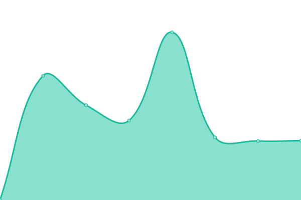

# [📈 Live Status](https://upptime.github.io/upptime): <!--live status--> **🟩 All systems operational**

This repository contains the open-source uptime monitor and status page for [Upptime](https://upptime.js.org), powered by [Upptime](https://github.com/upptime/upptime).

With [Upptime](https://upptime.js.org), you can get your own unlimited and free uptime monitor and status page, powered entirely by a GitHub repository. We use [Issues](https://github.com/upptime/upptime/issues) as incident reports, [Actions](https://github.com/mybigday/service-uptime/actions) as uptime monitors, and [Pages](https://upptime.github.io/upptime) for the status page.

<!--start: status pages-->
<!-- This summary is generated by Upptime (https://github.com/upptime/upptime) -->
<!-- Do not edit this manually, your changes will be overwritten -->
<!-- prettier-ignore -->
| URL | Status | History | Response Time | Uptime |
| --- | ------ | ------- | ------------- | ------ |
|  [BRICKS](https://display.bricks.tools/api/workspace-public-health-check) | 🟩 Up | [bricks.yml](https://github.com/mybigday/service-uptime/commits/HEAD/history/bricks.yml) | 

 509ms
     
 | 

<a href="https://status.bricks.tools/history/bricks">100.00%</a>
    

|  [BRICKS Device](https://device.bricks.tools/api/public-health-check) | 🟩 Up | [bricks-device.yml](https://github.com/mybigday/service-uptime/commits/HEAD/history/bricks-device.yml) | 

 469ms
     
 | 

<a href="https://status.bricks.tools/history/bricks-device">100.00%</a>
    

|  [Data Bank](https://bank.bricks.tools/api/not-found) | 🟩 Up | [data-bank.yml](https://github.com/mybigday/service-uptime/commits/HEAD/history/data-bank.yml) | 

 484ms
     
 | 

<a href="https://status.bricks.tools/history/data-bank">100.00%</a>
    

|  [Group (Legacy)](https://group.mybigday.com.tw) | 🟩 Up | [group-legacy.yml](https://github.com/mybigday/service-uptime/commits/HEAD/history/group-legacy.yml) | 

 483ms
     
 | 

<a href="https://status.bricks.tools/history/group-legacy">100.00%</a>
    

|  [Media Flow](https://media.bricks.tools) | 🟩 Up | [media-flow.yml](https://github.com/mybigday/service-uptime/commits/HEAD/history/media-flow.yml) | 

 493ms
     
 | 

<a href="https://status.bricks.tools/history/media-flow">100.00%</a>
    

|  [Activity Log](https://activity-log.bricks.tools/health) | 🟩 Up | [activity-log.yml](https://github.com/mybigday/service-uptime/commits/HEAD/history/activity-log.yml) | 

 2370ms
     
 | 

<a href="https://status.bricks.tools/history/activity-log">76.74%</a>
    

|  [Media Flow Companion](https://media-companion.bricks.tools) | 🟩 Up | [media-flow-companion.yml](https://github.com/mybigday/service-uptime/commits/HEAD/history/media-flow-companion.yml) | 

 478ms
     
 | 

<a href="https://status.bricks.tools/history/media-flow-companion">100.00%</a>
    

|  [DongDong Odoo](https://odoo.odoo.dongdong.in/healthcheck) | 🟩 Up | [dong-dong-odoo.yml](https://github.com/mybigday/service-uptime/commits/HEAD/history/dong-dong-odoo.yml) | 

 1306ms
     
 | 

<a href="https://status.bricks.tools/history/dong-dong-odoo">100.00%</a>
    

<!--end: status pages-->

[**Visit our status website →**](https://upptime.github.io/upptime)

## 📄 License

- Powered by: [Upptime](https://github.com/upptime/upptime)
- Code: [MIT](./LICENSE) © [Upptime](https://upptime.js.org)
- Data in the `./history` directory: [Open Database License](https://opendatacommons.org/licenses/odbl/1-0/)
