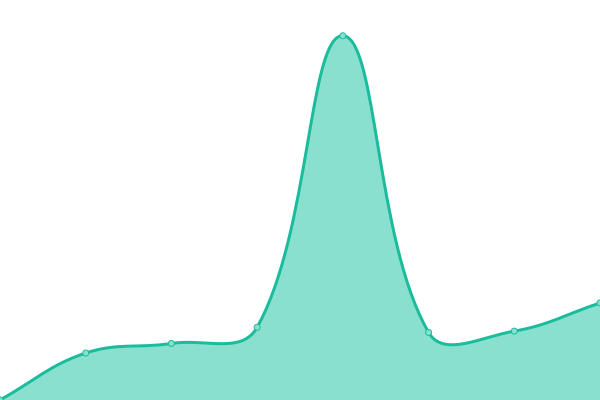

# [📈 Live Status](https://upptime.github.io/upptime): <!--live status--> **🟩 All systems operational**

This repository contains the open-source uptime monitor and status page for [Upptime](https://upptime.js.org), powered by [Upptime](https://github.com/upptime/upptime).

With [Upptime](https://upptime.js.org), you can get your own unlimited and free uptime monitor and status page, powered entirely by a GitHub repository. We use [Issues](https://github.com/upptime/upptime/issues) as incident reports, [Actions](https://github.com/mybigday/service-uptime/actions) as uptime monitors, and [Pages](https://upptime.github.io/upptime) for the status page.

<!--start: status pages-->
<!-- This summary is generated by Upptime (https://github.com/upptime/upptime) -->
<!-- Do not edit this manually, your changes will be overwritten -->
<!-- prettier-ignore -->
| URL | Status | History | Response Time | Uptime |
| --- | ------ | ------- | ------------- | ------ |
|  [BRICKS](https://display.bricks.tools) | 🟩 Up | [bricks.yml](https://github.com/mybigday/service-uptime/commits/HEAD/history/bricks.yml) | 

 563ms
     
 | 

<a href="https://status.bricks.tools/history/bricks">100.00%</a>
    

|  [BRICKS BETA](https://display-beta.bricks.tools) | 🟩 Up | [bricks-beta.yml](https://github.com/mybigday/service-uptime/commits/HEAD/history/bricks-beta.yml) | 

 565ms
     
 | 

<a href="https://status.bricks.tools/history/bricks-beta">100.00%</a>
    

|  [BRICKS Bank](https://bank.bricks.tools/update) | 🟩 Up | [bricks-bank.yml](https://github.com/mybigday/service-uptime/commits/HEAD/history/bricks-bank.yml) | 

 579ms
     
 | 

<a href="https://status.bricks.tools/history/bricks-bank">100.00%</a>
    

|  [BRICKS Bank BETA](https://bank-beta.bricks.tools/update) | 🟩 Up | [bricks-bank-beta.yml](https://github.com/mybigday/service-uptime/commits/HEAD/history/bricks-bank-beta.yml) | 

 561ms
     
 | 

<a href="https://status.bricks.tools/history/bricks-bank-beta">100.00%</a>
    

|  [MyBigDay Group](https://group.mybigday.com.tw) | 🟩 Up | [my-big-day-group.yml](https://github.com/mybigday/service-uptime/commits/HEAD/history/my-big-day-group.yml) | 

 669ms
     
 | 

<a href="https://status.bricks.tools/history/my-big-day-group">100.00%</a>
    

|  [MyBigDay Group BETA](https://group-beta.mybigday.com.tw) | 🟩 Up | [my-big-day-group-beta.yml](https://github.com/mybigday/service-uptime/commits/HEAD/history/my-big-day-group-beta.yml) | 

 841ms
     
 | 

<a href="https://status.bricks.tools/history/my-big-day-group-beta">100.00%</a>
    

|  [BotHub (GCP)](https://bothub.mybigday.com.tw) | 🟩 Up | [bot-hub-gcp.yml](https://github.com/mybigday/service-uptime/commits/HEAD/history/bot-hub-gcp.yml) | 

 655ms
     
 | 

<a href="https://status.bricks.tools/history/bot-hub-gcp">100.00%</a>
    

|  [BotHub BETA](https://bothub-beta.bricks.tw) | 🟩 Up | [bot-hub-beta.yml](https://github.com/mybigday/service-uptime/commits/HEAD/history/bot-hub-beta.yml) | 

 685ms
     
 | 

<a href="https://status.bricks.tools/history/bot-hub-beta">100.00%</a>
    

|  [Media Flow](https://media.bricks.tools) | 🟩 Up | [media-flow.yml](https://github.com/mybigday/service-uptime/commits/HEAD/history/media-flow.yml) | 

 558ms
     
 | 

<a href="https://status.bricks.tools/history/media-flow">100.00%</a>
    

|  [Media Flow BETA](https://media-beta.bricks.tools) | 🟩 Up | [media-flow-beta.yml](https://github.com/mybigday/service-uptime/commits/HEAD/history/media-flow-beta.yml) | 

 556ms
     
 | 

<a href="https://status.bricks.tools/history/media-flow-beta">100.00%</a>
    

|  [Media Companion](https://media-companion.bricks.tools) | 🟩 Up | [media-companion.yml](https://github.com/mybigday/service-uptime/commits/HEAD/history/media-companion.yml) | 

 566ms
     
 | 

<a href="https://status.bricks.tools/history/media-companion">100.00%</a>
    

|  [Media Resource (Auth0)](https://media-beta.bricks.tw) | 🟩 Up | [media-resource-auth0.yml](https://github.com/mybigday/service-uptime/commits/HEAD/history/media-resource-auth0.yml) | 

 612ms
     
 | 

<a href="https://status.bricks.tools/history/media-resource-auth0">100.00%</a>
    

|  [Media Resource (Legacy)](https://media.mybigday.com.tw) | 🟩 Up | [media-resource-legacy.yml](https://github.com/mybigday/service-uptime/commits/HEAD/history/media-resource-legacy.yml) | 

 599ms
     
 | 

<a href="https://status.bricks.tools/history/media-resource-legacy">99.28%</a>
    

|  [MyBigDay User (Legacy)](https://user.mybigday.com.tw) | 🟩 Up | [my-big-day-user-legacy.yml](https://github.com/mybigday/service-uptime/commits/HEAD/history/my-big-day-user-legacy.yml) | 

 325ms
     
 | 

<a href="https://status.bricks.tools/history/my-big-day-user-legacy">99.29%</a>
    

<!--end: status pages-->

[**Visit our status website →**](https://upptime.github.io/upptime)

## 📄 License

- Powered by: [Upptime](https://github.com/upptime/upptime)
- Code: [MIT](./LICENSE) © [Upptime](https://upptime.js.org)
- Data in the `./history` directory: [Open Database License](https://opendatacommons.org/licenses/odbl/1-0/)
